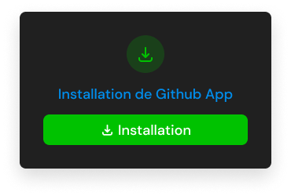

# 🤖 What is Feature?

Our vision is to encourage developers to contribute to projects on GitHub, by being rewarded with cryptocurrencies.

You can still use Feature to improve your software development productivity.


It is currently deployed on [Gnosis Chain](https://www.xdaichain.com), [Polygon](https://polygon.technology) and [Arbitrum](https://arbitrum.io).


You can benefit from Feature services directly on Github. A Github bot parses your issues to create truly secure payments.

## Getting Started

1\) [**Click here**](https://beta.v1.evm.app.feature.sh) to start the **Feature App installation**.

2\) Once on the Feature installation page, click on **Installation**. You will be redirected to GitHub.

3\) **Select** the **account** or **organization** where you want to install the bot.

4\) **Select** the **repositories** in which the bot will be used, then click on **Install**.


The Feature bot will **only** have the permission to:

* **Read** access to metadata;
* **Read** and **write** access to issues and pull requests.

\
Feature never has access to your code but only to the names of directories and contributors (metadata) and the thread of issues and pull requests.


4\) Then, **sign in** or **start your 14-day free trial**, in order to be able to use Feature.

4\) After signing in, **you're done**! You can see every deals that have been created with Feature bot.

Congratulations on completing the installation 🎉\
\
Now it's time to make your first deal to start increasing your product development productivity 🤓
