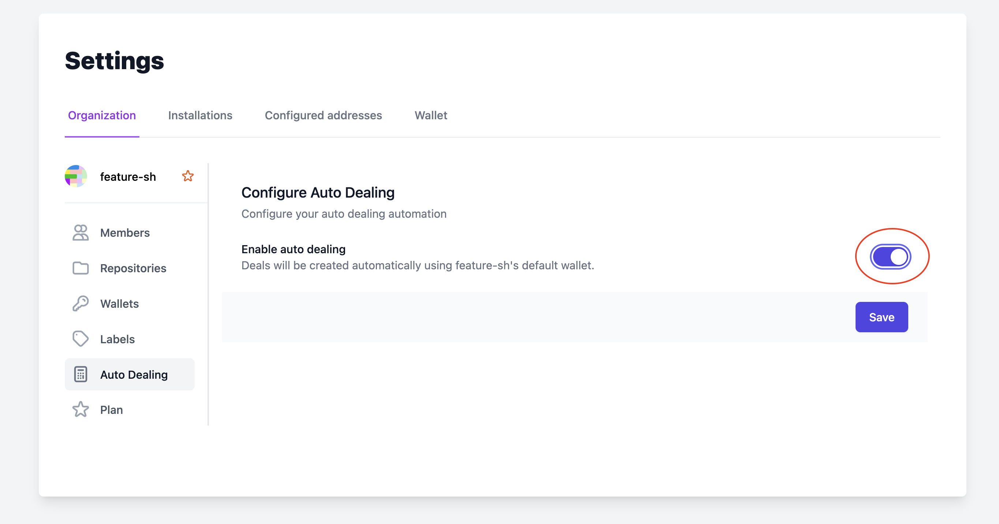
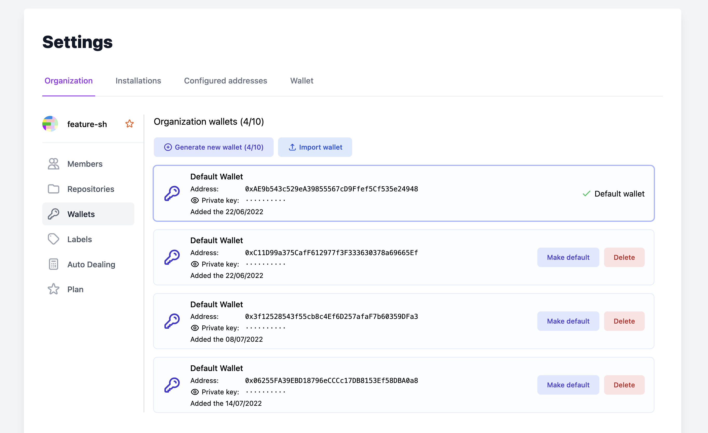
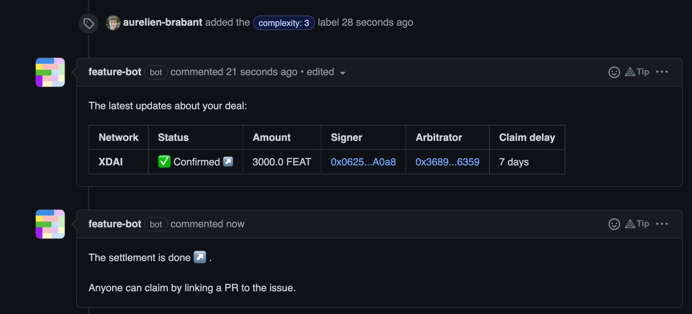
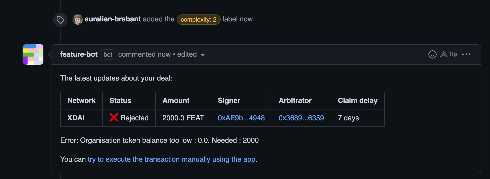

---
description:
---

# Set up auto dealing

To make creating deals even more easy, Feature allows organizations to manage special wallets that can be used to automatically sign the blockchain transaction that is required to create a new deal.

Using auto dealing, you will simply have to label an issue with a [Feature label](/guides/create-a-deal-using-labels) and the deal will be created automatically without further action.


Auto dealing only works with issue labelling as of now.


1\) Enable auto dealing in your [organization settings](https://dashboard.feature.sh/settings/installations) as shown below:

2\) Manage your organization wallets and set the one you want to use for auto dealing by selecting it as the default.

3\) Label an issue with a Feature label and let the magic happen 🪄.The transaction can take up to a few minutes to be processed, but fortunately the Bot will keep you updated about the progress!


The selected wallet should have the necessary funds to create the deal, otherwise an error message will be thrown by the bot.


