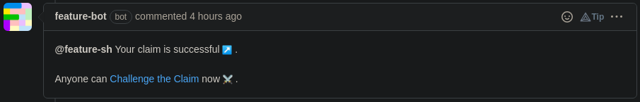
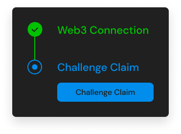
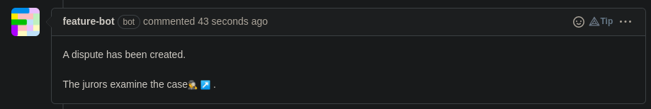

# ⚔ Challenge a Claim

During the review period, you can challenge the claimer if the specifications
are not met.

1\) If you think that the last claimer's PR doesn't meet the deal creator's
specifications, click on **_Challenge the Claim_**.

2\) Once redirected, connect your wallet and click on **_Challenge Claim_**.

3\) After that, **wait** for the jurors to make their ruling.

4\) Once the dispute is resolved, the bot will tell you who wins the dispute.

a) If the **claimer wins**, he will **earn the dispute funds** and will be able to
**[execute the payment](execute-a-payment.md)**.

b) If the **challenger wins**, he will **earn the dispute funds** and the
**previous claim will be canceled**. Then, anybody
can **[claim the reward](claim-your-reward.md) again**.

c) If the **jurors couldn't choose a winner**, the **dispute funds are given to
the challenger**, and the **claimer will be able to [execute the payment](execute-a-payment.md)**.

 
