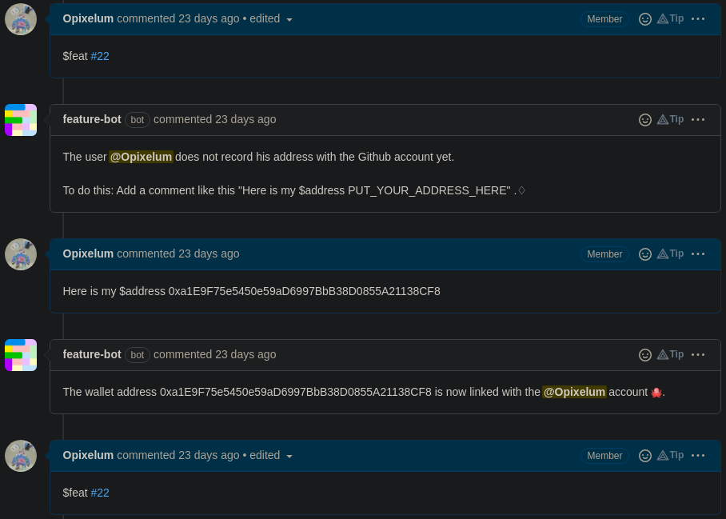

# 🙋 Claim your Reward

If you made a Pull Request relative to the deal, you are ready to claim your reward:


If it's your **first time claiming**, you need to **link** your **GitHub account** with your **wallet address**. In that case, **do step 1**. Then, the bot will ask you to do it.

After that, just **do step 1 again** and follow this tutorial.



1\) **Comment** the **number** of your **Pull Request** with the keyword **`$feat`** .

2\) **Click** on the link to be redirected to the **claiming page**.

3\) **Connect your wallet** and click on **Claim**.

4\) Once redirected on GitHub, the Feature bot will tell you that **you claimed successfully**!


If nobody has challenged your claim within the challenge period, you will be able to [execute the deal](execute-a-deal.md) to receive your reward.

