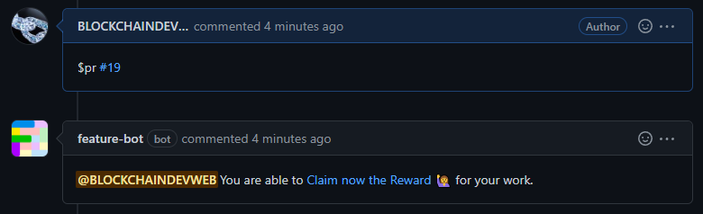
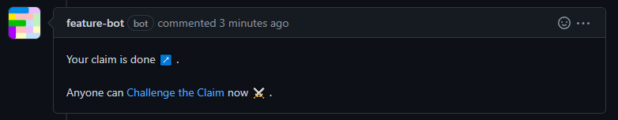

# 🙋 Claim your Reward

If you made a Pull Request relative to the deal, you are ready to claim your reward:

1\) **Comment** the **number** of your **Pull Request** with the keyword **`$PR, $pr, $claim`** or **`$fixed`** .

<figure><figcaption>
Linking a PR to claim
</figcaption></figure>

2\) **Click** on the link to be redirected to the **claiming page**.


If you are in [autodealing](https://docs.feature.sh/guides/auto-dealing) just click on `Claim` and you will be redirected to the claiming page.


3\) **Connect your wallet** and click on **Claim**.

4\) Once redirected on GitHub, the Feature bot will tell you that **you claimed successfully**!

<figure><figcaption></figcaption></figure>


If nobody has challenged your claim within the challenge period, you will be able to [execute the refund](https://docs.feature.sh/guides/get-refunded) to receive your reward.

