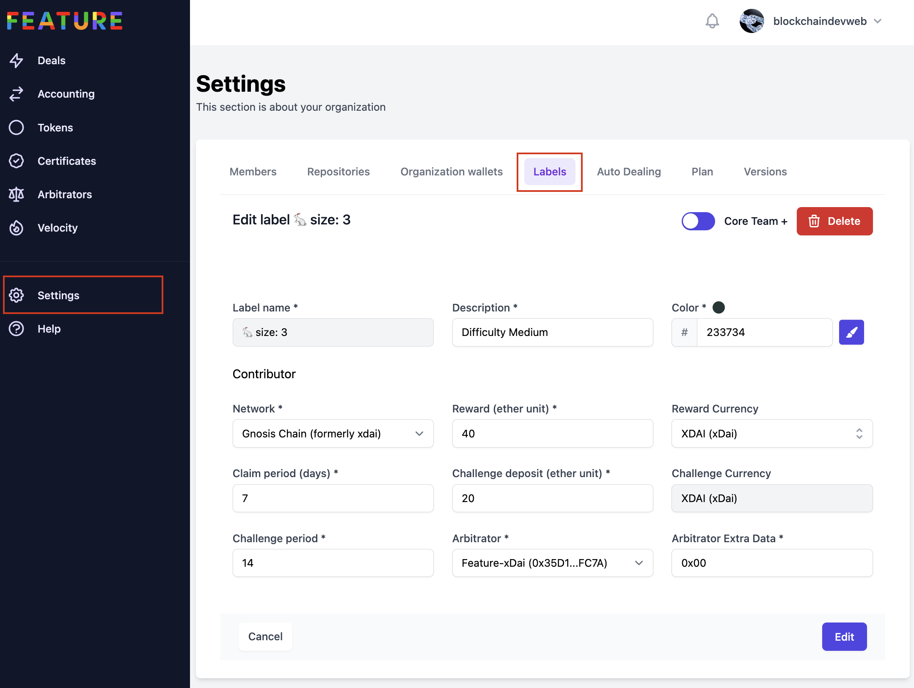
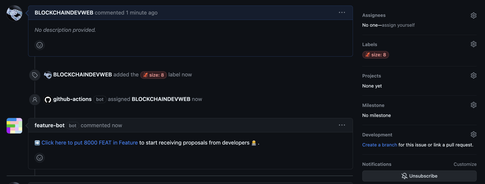

# 🏷 Create a deal using GitHub Labels

By labelling any issue with a special label, you can automatically create a new deal for your developers.

1\) [Access to the label editor](https://dashboard.feature.sh/settings/labels) for your organization. Once you are on the right page, you can start creating, editing or deleting any label available to your installation.

Note that any operation performed on labels will affect **all the repositories managed by features**.

2\) Once your label is created, you can simply label any issue with it and our Bot will take care of it.

You can then put the cryptocurrency amount in escrow and proceed normally.

**Protip**: Feature allows you to automate this process so that you won't have to manually deposit anything in escrow, using organization wallets. Learn more about the [auto dealing](https://docs.feature.sh/guides/auto-dealing) feature.
