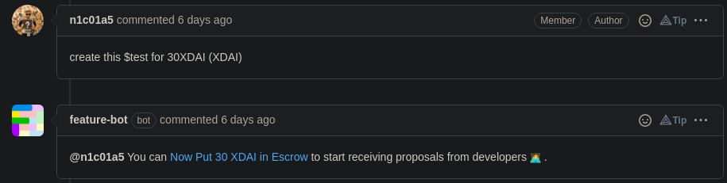
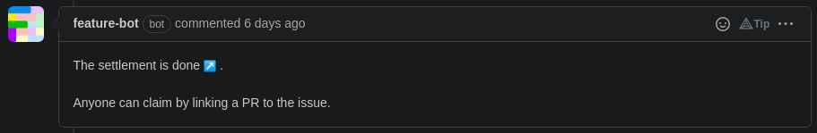

# ⚡ Create a Deal

1\) Open an **issue** on Github.

2\) **Entitle** it or add a **comment** with this format: _$\<issue\_type> \<crypto\_amount> (\<network>)_.

3\) The Feature bot will ask you to **put the cryptocurrency amount in Escrow**. **Click on the link** to be redirected to the related page.


ERC20 compatible (WIP)


4\) **Connect your wallet**. If enough funds, you will be able to approve the transfer.

5\) **Click on Create the Deal**. Once transaction done, you will be automatically redirected to GitHub.

6\) The bot will comment that **you've created the Deal successfully**!\

