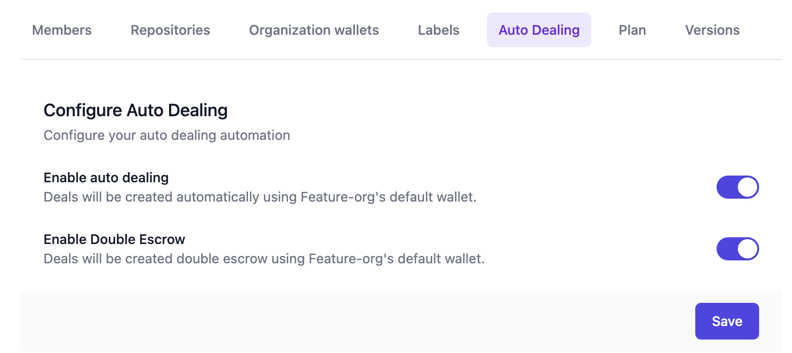
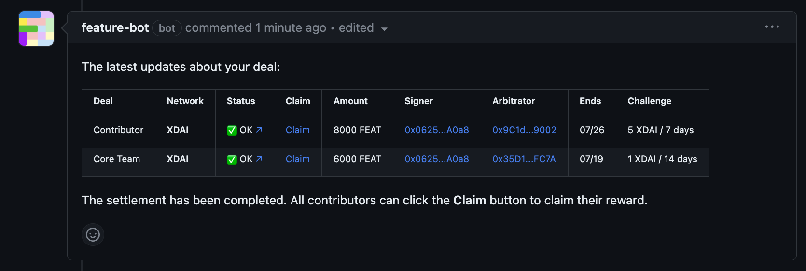
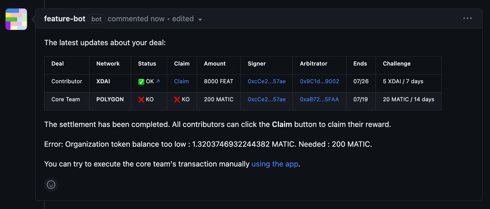

# ✌ Double escrow

The application allows setting up different rewards in function of the claimants if they are part of the core team or if they are external contributors.

This is particularly useful to avoid a kind of _double spend_ if core team members already receive a fixed salary while using FEATURE to provide additional incentives and track the velocity of core team members.


Double escrow works only with auto dealing enabled.


1\) Enable auto dealing and double escrow in your [organization settings](https://dev.dashboard.feature.sh/settings/wallets) as shown below:

<figure><figcaption></figcaption></figure>

2\) Manage your organization wallets and set the one you want to use for auto dealing by selecting it as the default.

3\) Label an issue with a Feature label and let the magic happen 🪄. The transaction can take up to a few minutes to be processed, but fortunately the Bot will keep you updated about the progress!

The _Claim_ link contains the information of the reward that the contributor or core team can claim.

<figure><figcaption>
Double escrow with the FEATURE bot
</figcaption></figure>


The selected wallet should have the necessary funds to create the deal, otherwise an error message will be thrown by the bot.


<figure><figcaption>
FEATURE bot error if there is not enough fund in the wallet
</figcaption></figure>

Use the double escrow ✌️ to create even more personalized incentives!
