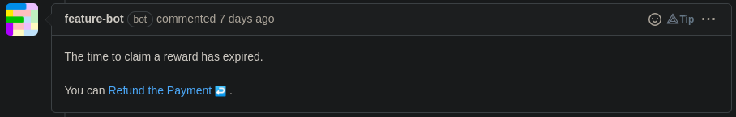

# 🔁 Refund

Nobody has claimed on time? As a Deal creator, you can be refunded your money
put in Escrow.

1\) If **time to claim a reward has expired**, Feature bot will automatically
comment the related issue.

2\) Click on **_Refund the Payment_**, then **connect your wallet**.


Anyone can execute the refund, but **only the Deal creator will receive the
money in Escrow**. The one who execute it will only pay the transaction fees.


3\) Once the transaction is mined, the **refund is complete**! Check your
wallet to see your money back.
